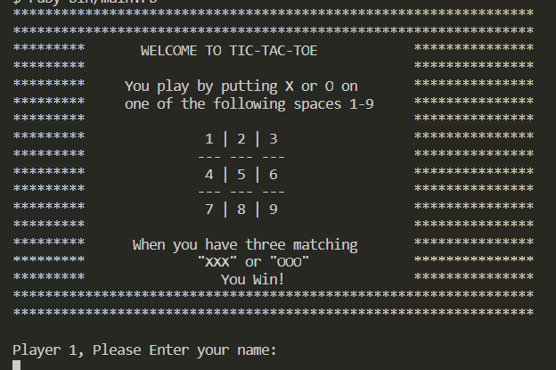

# Tic-Tac-Toe Game -- Rspec Testing

> One paragraph statement about the project.

Rspec is the most widely used testing framework for Ruby and Ruby on Rails

## Built With

- Ruby
- Rubocop
- Visual Studio Code
- Rspec

## Getting Started

To get a local copy:
  - Clone the repository using < git clone https://github.com/chrystalme/tic-tac-toe_ruby.git >
  - Change directory to the parent folder of the project using< cd tic-tac-toe-ruby >
 

### Prerequisites

  - Ruby has to be installed on your system if you don't have ruby, install it using < gem install ruby>
  - Rspec can be installed using gem as well < gem install rspec>

### Run tests
 - Run tests with < ruby spec/game_board_spec.rb>

## Authors

👤 **Malieze Afam Ifeanyi**

- GitHub: [@chrystalme](https://github.com/chrystalme)
- Twitter: [@afam_ifeanyi](https://twitter.com/afam_ifeanyi)
- LinkedIn: [Malieze Afam Ifeanyi(chrys)](https://linkedin.com/afam-chrys)

## 🤝 Contributing

Contributions, issues, and feature requests are welcome!

Feel free to check the [issues page](https://github.com/chrystalme/tic-tac-toe_ruby/issues).

## Show your support

Give a ⭐️ if you like this project!

## Acknowledgments

- Hat tip to anyone whose code was used
- Inspiration
- etc

## 📝 License

This project is [MIT](https://mit-license.org/) licensed.
